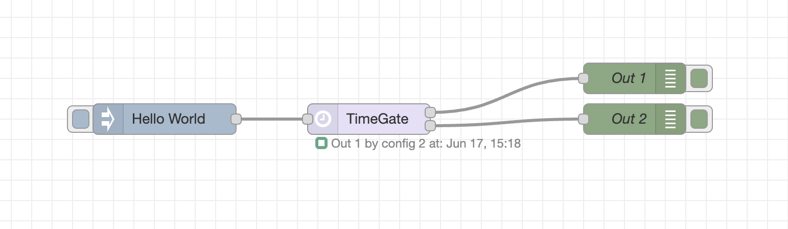
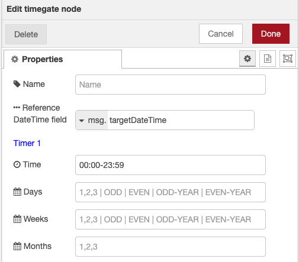

# node-red-contrib-timegate

## Switches the input received on out1 or out2 depending on the time and the settings of the node.
  
  
The node compares the current time to up to five different time configurations and thansfers its input unmodified on the first output if the current time matches any of the configuration or, otherwise, on the second output.




### Inputs
```
msg (any type)
````
Any input message is passed unmodified to one of the outputs.

### Outputs
```
out-1
```
Passes the input msg when any of the time configuration matches the current time.

```
out-2
```
passes the input msg when none of the timer matches the current time.

## Configurations

You can configure up to five different time matching configurations.



For each configuration, you can specify these parameters:

### Time
One or more time ranges separated by commas.

Example:
```
10:15-11:30 or 10:00-12:00,15:30-16:30
```

### Day
One or more day values separated by commas.

Possible values:
- 1,8,15,21 to match the day number
- SUN,MON,TUE,WED,THU,FRI,SAT to match the day name
- ODD,EVEN to match odd or even days based on the number of the day in the month (1-31)
- ODD-YEAR,EVEN-YEAR to match odd or even days based on the number of the day in the year (1-365)

Example:
```
1,SUN,ODD is true for: the first day of the month, every sundays and every odd day number in the month

SAT,SUN,EVEN-YEAR is true on saturdays and sundays and on every even day based the number of the day in the year
```

### Week
One or more week values separated by commas.

Possible values:
- 1,2,3,4,5,6 to match the week number in the month
- ODD,EVEN to match odd or even weeks based on the number of the week in the month (1-6)
- ODD-YEAR,EVEN-YEAR to match odd or even weeks based on the number of the day in the year (1-52)

Example:
```
1,EVEN-YEAR is true for: the first week of the month and every even week number in the year
```

### Month
One or more month values separated by commas.

Possible values:
- 1,2,3,4,5,6 to match the month

Example:
```
1,2,3 is true for: January, February and March
```

### Multiple configurations

For every **timer configuration** the **time** settings is mandatory.
If you add any **day**, **week** or **month** settings, these are evaluated in **AND** between each other.

Multiple timer configurations are evaluated in **OR** between each other.

Example:
```
Time: 10:00-11:00
Day: ODD
Week: ENEN-YEAR
Month: 1,2,3,4,5,6

```
This configuration will pass the input to Out-1 only from 10:00 to 11:00 of every odd day (based on the number of the day in the month) of every even week (based on the number of the week in the year) and from January to June.
Otherwise, it will pass the input to Out-2.

### Example
See the [example](timegate/examples/sample.json) for a basic setup of the node

## References

GitHub - the nodes github repository

## Donations

If you use and appreciate this software, please consider the idea of supporting my efforts in mantaining it.

Thanks.

[](https://www.paypal.com/donate/?business=5RMJWB9RBHKXE&no_recurring=0&item_name=I+am+very+pleased+if+you+appreciate+my+open+source+software+and+if+you+want+to+help+support+my+efforts.&currency_code=EUR)

## Changelog
* 1.0.0 First release
* 1.0.1 Minor fixes